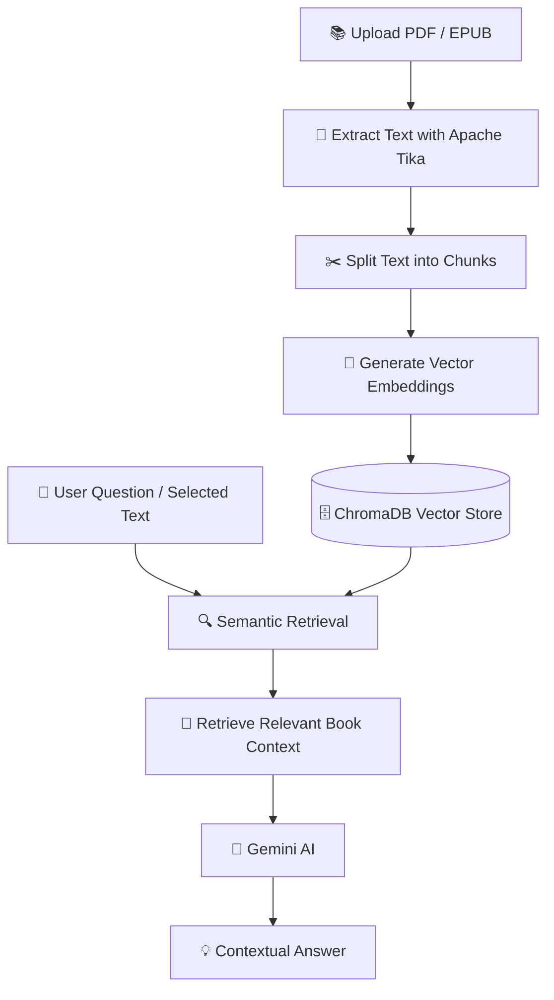
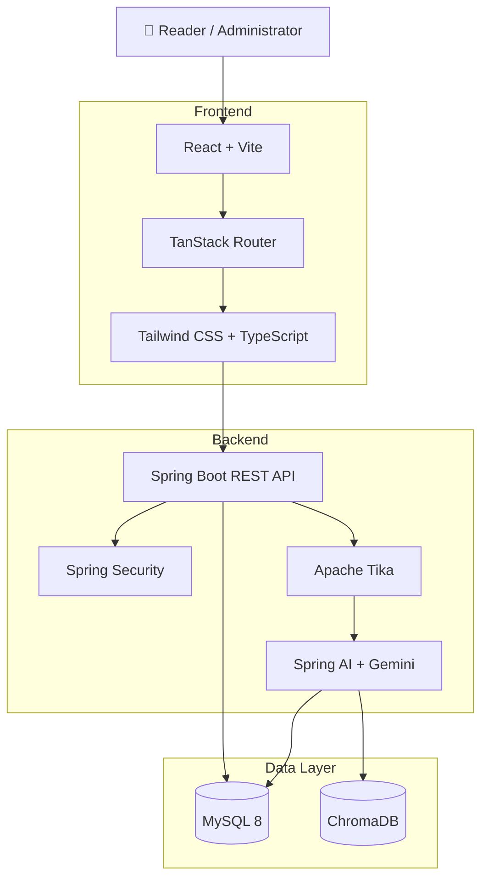

# 📚 Zen Shelf Hub — Virtual Library

<div align="center">

  

  <h3>📖 Read. Reflect. Discover.</h3>

  <p>
    An AI-powered virtual library that combines immersive reading,
    intelligent book analysis, and a personalized digital library experience.
  </p>

  <p>
    <a href="https://github.com/TORBIomar/Virtual-Library">
      
    </a>
    
    
    
    
  </p>

</div>

---

## 🌟 Overview

**Zen Shelf Hub** is a full-stack digital library platform built to transform the way readers interact with books.

It provides a distraction-free reading environment where users can explore books, track their reading progress, write reviews, manage their wishlists, and interact with an intelligent AI reading companion.

Powered by **Retrieval-Augmented Generation (RAG)**, the AI companion uses the content of the book being read to provide contextual explanations, answer questions, and help readers better understand complex ideas.

The platform also includes an administration dashboard for managing books, users, reviews, and AI configuration.

## ✨ Key Features

### 📖 Immersive Reading Experience

* 🎨 Clean, distraction-free reading interface.
* 🔖 Persistent reading progress and page tracking.
* 🔠 Adjustable font sizes for personalized reading.
* 🧘 Zen Mode for focused and comfortable reading.
* 📚 Digital library with book discovery and management.

### 🤖 AI Reading Companion

* 💬 Interactive AI chatbot powered by Google Gemini.
* 🔍 Retrieval-Augmented Generation (RAG) for contextual responses.
* 📌 Ask questions about the book you are currently reading.
* 📝 Select text and request explanations or analysis.
* 🧠 Semantic search across extracted book content.
* 🎯 Responses grounded in relevant book context to reduce unsupported answers.

> **Goal:** Help readers understand, explore, and engage with their books without leaving the reading environment.

### 📂 Book Uploading & Intelligent Processing

* 📤 Admin-controlled EPUB and PDF uploads.
* 📄 Automatic text extraction using Apache Tika.
* 🧩 Document chunking for retrieval.
* 🔢 Vector embedding generation.
* 🔍 Semantic search powered by ChromaDB.
* 📚 Book content preparation for AI-assisted reading.

### ⭐ Reviews & Ratings

* ✍️ Write and publish book reviews.
* ⭐ Rate books based on your reading experience.
* 📊 View aggregated book ratings.
* 🛡️ Review moderation through the administration dashboard.

### 🛠️ Dynamic Administration

* 👥 Manage registered users.
* 📚 Upload and manage digital books.
* 📝 Moderate user reviews.
* ⚙️ Configure AI model settings.
* 🔑 Manage Gemini API configuration through the admin interface.
* 📊 Access administrative features through a centralized dashboard.

---

## 🧠 How the AI Reading Companion Works

Zen Shelf Hub uses a **Retrieval-Augmented Generation (RAG)** pipeline to connect the AI model with the content of the book.



### RAG Workflow

1. **Upload:** An administrator uploads a PDF or EPUB book.
2. **Extraction:** Apache Tika extracts the text from the document.
3. **Processing:** The text is divided into smaller chunks.
4. **Embedding:** Chunks are transformed into vector embeddings.
5. **Storage:** Embeddings are stored in ChromaDB for semantic retrieval.
6. **Query:** A reader asks a question or selects a passage.
7. **Retrieval:** Relevant book passages are retrieved from the vector database.
8. **Generation:** Gemini generates an answer using the retrieved context.

This approach helps the AI focus on the content of the book rather than relying solely on general knowledge.

---

## 🏗️ System Architecture



---

## 🛠️ Technology Stack

### Frontend

| Technology      | Purpose                                    |
| --------------- | ------------------------------------------ |
| React           | User interface development                 |
| Vite            | Frontend build tool and development server |
| TypeScript      | Type-safe JavaScript development           |
| Tailwind CSS    | Responsive and customizable styling        |
| TanStack Router | Client-side routing                        |

### Backend

| Technology      | Purpose                                   |
| --------------- | ----------------------------------------- |
| Java 17         | Backend programming language              |
| Spring Boot 3   | REST API and application framework        |
| Spring Security | Authentication and authorization          |
| Spring AI       | AI model integration and RAG capabilities |
| Hibernate       | ORM and database interaction              |
| Apache Tika     | PDF and EPUB text extraction              |

### Database & Infrastructure

| Technology     | Purpose                               |
| -------------- | ------------------------------------- |
| MySQL 8        | Relational data persistence           |
| ChromaDB       | Vector storage and semantic retrieval |
| Docker         | Containerization                      |
| Docker Compose | Multi-service orchestration           |
| Nginx          | Web server and reverse proxy          |

---

## 🚀 Getting Started

### Prerequisites

Make sure you have the following installed:

* [Docker Desktop](https://docs.docker.com/get-docker/)
* Git
* A valid Google Gemini API key

### 🐳 Option 1: Run with Docker Compose (Recommended)

The easiest way to launch the complete application stack is through Docker Compose.

#### 1. Clone the Repository

```bash
git clone https://github.com/TORBIomar/Virtual-Library.git
cd Virtual-Library
```

#### 2. Configure Environment Variables

Create a `.env` file in the project root:

```bash
echo "GEMINI_API_KEY=your_api_key_here" > .env
```

> **Security:** Never commit your API key or `.env` file to a public repository. Use environment variables and keep your secrets private.

#### 3. Start the Application

```bash
docker-compose up --build -d
```

#### 4. Access the Application

Open your browser and navigate to:

```text
http://localhost:3000
```

Then:

1. Register a new account.
2. Sign in to the application.
3. Open the Admin dashboard if your account has administrator privileges.
4. Configure the Gemini API settings according to your deployment.
5. Upload your first book.
6. Start reading and explore the AI companion.

---

## 💻 Local Development Setup

Use this approach if you want to develop the frontend and backend independently while running the infrastructure through Docker.

### 1. Start Infrastructure Services

From the project root:

```bash
docker-compose up mysql chromadb -d
```

This starts the MySQL and ChromaDB services defined in your Docker Compose configuration.

### 2. Start the Backend

Navigate to the backend directory:

```bash
cd Backend
```

Run the Spring Boot application using the Maven wrapper.

**Linux / macOS:**

```bash
./mvnw spring-boot:run
```

**Windows:**

```bash
mvnw.cmd spring-boot:run
```

Make sure the required database connection and AI configuration are available to the backend.

### 3. Start the Frontend

Open another terminal and navigate to the frontend directory:

```bash
cd Frontend
```

Install dependencies:

```bash
npm install
```

Start the development server:

```bash
npm run dev
```

The frontend should be available at:

```text
http://localhost:5173
```

> The exact backend port, database configuration, and frontend API URL depend on the project configuration.

---

## 🔐 Environment Variables

When running the project locally, configure the required application settings through your Spring Boot configuration or environment variables.

Example:

```properties
# Database
spring.datasource.url=jdbc:mysql://localhost:3306/your_database
spring.datasource.username=your_username
spring.datasource.password=your_password

# Gemini
GEMINI_API_KEY=your_api_key_here
```

**Important:** Use the actual property names expected by your Spring Boot application. The example above is illustrative and should be adapted to your configuration.

Do not expose API keys in source code, public repositories, or frontend bundles.

---

## 📁 Project Structure

The following is an illustrative structure. Adjust the names to match the actual repository.

```text
Virtual-Library/
│
├── Backend/
│   ├── src/
│   ├── pom.xml
│   └── mvnw
│
├── Frontend/
│   ├── src/
│   ├── public/
│   ├── package.json
│   └── vite.config.ts
│
├── docker-compose.yml
├── .env.example
├── .gitignore
└── README.md
```

---

## 🔒 Security Considerations

* Store API keys securely using environment variables or protected server-side configuration.
* Protect administrative routes with authentication and authorization.
* Validate and sanitize uploaded documents.
* Restrict book management and moderation features to authorized users.
* Avoid exposing sensitive AI configuration details to unauthorized clients.

---

## 🗺️ Future Improvements

Potential improvements for future versions:

* [ ] Reading statistics and personal reading analytics.
* [ ] Bookmarks and custom highlights.
* [ ] Advanced reading progress tracking.
* [ ] Multi-book AI conversations.
* [ ] Improved citation and source passage display in AI responses.
* [ ] Personalized book recommendations.
* [ ] Dark mode and additional reading themes.
* [ ] Social reading and book collections.
* [ ] Automated tests and CI/CD integration.
* [ ] Support for additional document formats.

---

## 📄 License

This project is licensed under the **MIT License**.

See the `LICENSE` file for more information.

---

<div align="center">

### 📚 Read at your own pace. Learn with intelligence.

Built with ❤️ by **[Omar Torbi](https://github.com/TORBIomar)**

⭐ If you find this project interesting, consider starring the repository!

</div>
